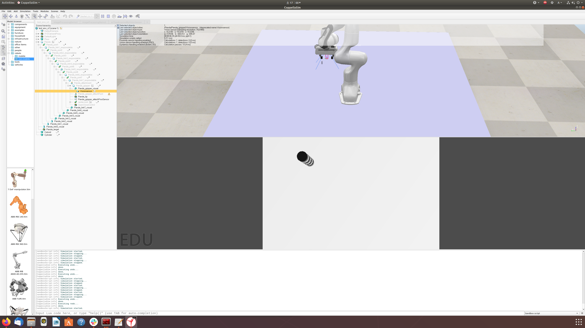

# Learning-pick-and-place-sim
## セットアップ方法
- [gitリポジトリ](https://github.com/pantor/learning-pick-and-place)をクローン
- 先程クローンしたディレクトリの中にこのリポジトリをクローン
- Dockerのディレクトリに[ここ](https://www.coppeliarobotics.com/downloads)から**CoppeliaSim Edu**をダウンロード（Ubuntu20.04）
- Dockerfileのcoppeliasimのインストールについて書かれている部分を先ほどダウンロードしたファイル名に変更
- Dockerディレクトリの中のrun.shを各々で調整
- terminalで次のコードを実行
```shell
$ ./build.sh
$ ./run.sh
```

## すべての準備が完了した状態のディレクトリ構成test
- ~/
  - catkin_ws/
    - ...
  - workspace
    - CoppeliaSim_Edu_V4_4_0_rev0_Ubuntu20_04/
      - ...
- /home
  - /usrname
    - /learning-pick-and-place
      - /learning-pick-and-place-sim
        - Docker
          - ...
        - assets
          - ...
        - pick_and_place_Env.py

## タスクについて
- terminalでroscoreを立ち上げる。
- roscoreとはべつのterminalでデモとして以下を実行
```shell
$ python3 pick_and_place_Env.py
```


- テスト環境



## Coppelia-simのsceneについて
- assetsの中に2つのsceneがあり、v2はbinがBox、v3はbinがPlaneとなっている。

- シミュレータ内のカメラのdepth情報

